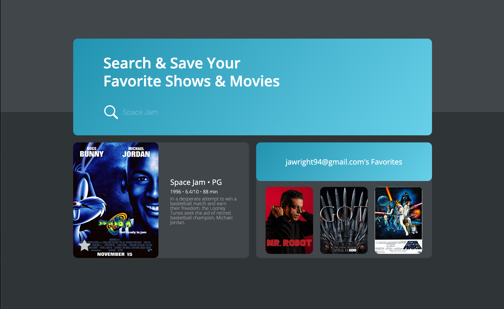

# EntertainmenMe README
[Try Me Out!](https://infinite-plains-20028.herokuapp.com/)

## What does this app do?

This project is meant to demo my abilities to assemble a MERN stack project. Using the OMDB API users can search up their favorites shows and movies, while logging storing them log back in at a later date to view information regarding the Show or Movie Title / Poster Image / IMDB rating / Movie Maturity Rating / Plot description / Movie Runtime. 

## 3rd Party API Usage

- [OMDB](https://www.omdbapi.com/)

- [YouTube Data v3](https://developers.google.com/youtube/v3)

### My primary goals for this project:

- enable users to search OMDB API for their favorite shows and movies
- uniquely store the logged in user's personal favorites
- display the logged in user's personal favorites

### What technologies are used?

- MySQL Database
- Express Server
- React Front End
- Node Backend

## How can I run this app as well?

1. Fork or Clone this repo 

2. Creat a  `.env` file in the server folder and add the following values, with their corresponding API access keys.

    `OMDB_API_KEY`
    
    `YT_API_KEY`

3. Ensure your MySQL server is running

4. Launch the client and server in development mode:

     `$ yarn start:dev`

5. Confirm Sequelize created the Users and Movies tables

6. Visit http://localhost:3000/ in your browser